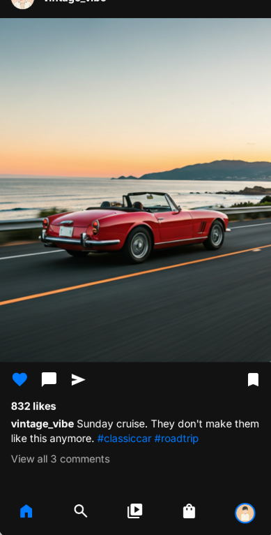
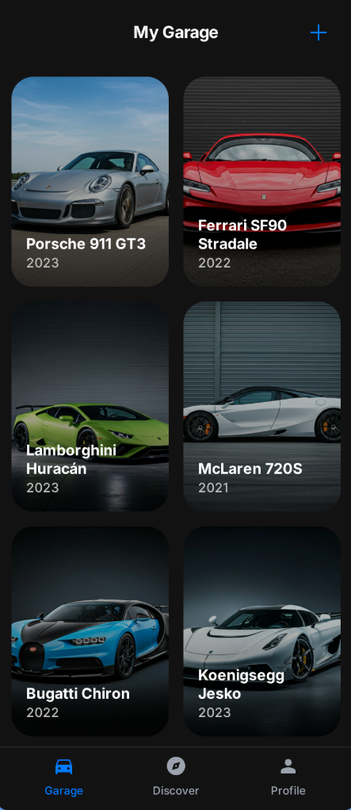

<div align="center">

# 📱 AutoStudio Mobile

### *Your Garage, In Your Pocket - Powered by AI*

**The Social Companion App for AutoGen Ecosystem**

[](https://expo.dev/)
[](https://reactnative.dev/)
[](https://www.typescriptlang.org/)
[](https://www.nativewind.dev/)
[](https://ai.google.dev/)

[🌐 Web App](../Autogen-main) • [📖 Full Documentation](../README.md) • [🚀 Get Started](#-quick-start)

</div>

---

## 📖 Table of Contents

- [🎯 What is AutoStudio Mobile?](#-what-is-autostudio-mobile)
- [✨ Key Features](#-key-features)
- [🏗️ Architecture](#️-architecture)
- [📱 Screens & Navigation](#-screens--navigation)
- [🛠️ Technology Stack](#️-technology-stack)
- [🚀 Quick Start](#-quick-start)
- [📁 Project Structure](#-project-structure)
- [🎨 Design System](#-design-system)
- [🧠 AI Integration](#-ai-integration)
- [🔗 Web + Mobile Sync](#-web--mobile-sync)
- [📦 Building for Production](#-building-for-production)
- [🐛 Troubleshooting](#-troubleshooting)
- [🤝 Contributing](#-contributing)

---

## 🎯 What is AutoStudio Mobile?

**AutoStudio Mobile** is the **React Native companion app** for the AutoGen ecosystem - a cross-platform social network designed exclusively for automotive enthusiasts. Built with **Expo SDK 54**, **NativeWind v4**, and powered by **Google Gemini AI**, it brings the full AutoGen experience to iOS and Android devices.

### The Mobile Advantage

While the **web application** is your creative powerhouse for deep editing and AI generation, **AutoStudio Mobile** is your **social companion** for:

- 📸 **Quick Camera Uploads** - Snap photos at car meets and upload instantly
- 🌐 **On-the-Go Browsing** - Scroll the feed anywhere, anytime
- 🚗 **Portable Garage** - Show off your collection to friends
- ⚡ **Real-Time Notifications** - Never miss a like, comment, or follow
- 📱 **Native Experience** - Smooth 60fps animations and gestures

### What You Can Do

- ✅ **Upload car photos** from camera or gallery
- ✅ **AI auto-detection** of make, model, year, specs, and mods
- ✅ **Browse Instagram-style feed** with stories carousel
- ✅ **Like, comment, share** posts from the community
- ✅ **Manage digital garage** with 2-column grid layout
- ✅ **Discover cars** by category and make/model
- ✅ **View user profiles** and public garages
- ✅ **Instant sync** with web platform via Supabase

**Everything syncs in real-time with the AutoGen web app!**

---

## ✨ Key Features

### 📸 **Instagram-Style Feed**
The heart of the mobile experience:

- **Stories Carousel**: Horizontal scrolling user stories with gradient borders
- **Post Cards**: Full-size image cards with like/comment/share actions
- **Smooth Scrolling**: Optimized FlatList with lazy loading
- **Pull to Refresh**: Real-time feed updates
- **Infinite Scroll**: Load more posts as you scroll

```typescript
// Feed Screen Implementation
<ScrollView className="flex-1 bg-background-dark">
  <StoryCarousel stories={mockStories} />
  {mockPosts.map(post => (
    <FeedPost key={post.id} post={post} />
  ))}
</ScrollView>
```

### 🚗 **2-Column Garage Grid**
Your personal car collection in a beautiful layout:

- **Masonry Grid**: Pinterest-style 2-column layout
- **Gradient Overlays**: LinearGradient for premium aesthetics
- **Quick Actions**: Edit and delete buttons on each card
- **Floating Add Button**: Camera-ready upload with expo-image-picker
- **Category Filters**: Sport, Classic, Luxury, SUV, Electric

```typescript
// Garage Grid Layout
<View className="flex-row flex-wrap justify-between p-4">
  {mockCars.map(car => (
    <View style={{ width: '48%' }} className="mb-4">
      <CarCard car={car} onEdit={handleEdit} onDelete={handleDelete} />
    </View>
  ))}
</View>
```

### 🎨 **Glassmorphism Tab Bar**
iOS-inspired bottom navigation:

- **BlurView Effect**: Frosted glass on iOS, solid on Android
- **Native Icons**: Lucide React Native icons
- **Active State**: Neon cyan highlight on selected tab
- **Platform Adaptive**: Respects iOS/Android design languages

```typescript
// Tab Bar with Blur
<Tabs
  screenOptions={{
    tabBarStyle: {
      position: 'absolute',
      backgroundColor: Platform.OS === 'ios' 
        ? 'rgba(18, 18, 18, 0.8)' 
        : '#121212',
      height: 80,
    },
    tabBarBackground: () => (
      Platform.OS === 'ios' ? (
        <BlurView intensity={80} tint="dark" style={StyleSheet.absoluteFill} />
      ) : null
    ),
  }}
/>
```

### 🤖 **AI-Powered Car Recognition**
Gemini 3 Pro analyzes your photos:

- **Auto-Fill**: Make, model, year, color automatically detected
- **Spec Detection**: Engine type, horsepower estimation
- **Mod Identification**: Aftermarket wheels, spoilers, exhausts
- **Multi-Image Analysis**: Upload 3+ angles for better accuracy

```typescript
// AI Car Analysis
const analysis = await analyzeCarUpload([base64Image]);

// Returns:
{
  "make": "Porsche",
  "model": "911 GT3 RS",
  "year": 2023,
  "color": "Miami Blue",
  "specs": {
    "engine": "4.0L Flat-6",
    "horsepower": 518,
    "mods": ["Carbon Fiber Wing", "BBS Wheels"]
  }
}
```

### 🔐 **Seamless Authentication**
Supabase Auth with native UX:

- **Email/Password**: Simple signup and login
- **Session Persistence**: AsyncStorage for auto-login
- **Secure**: JWT tokens with automatic refresh
- **Shared Accounts**: Same credentials as web app

```typescript
// Login Handler
const handleLogin = async () => {
  const { data, error } = await supabase.auth.signInWithPassword({
    email,
    password
  });
  
  if (data.session) {
    router.replace('/(tabs)');
  }
};
```

### 🌐 **Real-Time Synchronization**
Instant updates across platforms:

- Upload a car on mobile → Appears on web instantly
- Generate photoshoot on web → Shows in mobile feed
- Like a post on mobile → Counter updates on web
- Edit garage on web → Mobile reflects changes

---

## 🏗️ Architecture

### Cross-Platform Ecosystem

```
┌─────────────────────────────────────────────────────────────┐
│                  AutoGen Ecosystem                          │
├─────────────────────────────────────────────────────────────┤
│                                                             │
│  ┌──────────────────┐              ┌──────────────────┐    │
│  │   Web Platform   │◄────Sync────►│  Mobile App      │    │
│  │   (React 19)     │              │  (React Native)  │    │
│  │                  │              │                  │    │
│  │  • AI Studio     │              │  • Feed Screen   │    │
│  │  • Heavy Editing │              │  • Garage Grid   │    │
│  │  • Photoshoots   │              │  • Quick Upload  │    │
│  │  • Video Gen     │              │  • Social Browse │    │
│  └────────┬─────────┘              └────────┬─────────┘    │
│           │                                 │              │
│           └────────────┬────────────────────┘              │
│                        │                                   │
│                        ▼                                   │
│            ┌───────────────────────┐                       │
│            │   Supabase Backend    │                       │
│            │   • PostgreSQL DB     │                       │
│            │   • Auth & Sessions   │                       │
│            │   • Storage Buckets   │                       │
│            │   • Real-time Subs    │                       │
│            └───────────┬───────────┘                       │
│                        │                                   │
│                        ▼                                   │
│            ┌───────────────────────┐                       │
│            │   Google Gemini API   │                       │
│            │   • Car Analysis      │                       │
│            │   • Image Generation  │                       │
│            └───────────────────────┘                       │
│                                                             │
└─────────────────────────────────────────────────────────────┘
```

### Shared Backend

Both applications use the **same Supabase project**:

| Service | Purpose | Used By |
|---------|---------|---------|
| **PostgreSQL** | Users, cars, posts, likes | Web ✅ Mobile ✅ |
| **Auth** | Email/password sessions | Web ✅ Mobile ✅ |
| **Storage** | Car photos, AI generations | Web ✅ Mobile ✅ |
| **Realtime** | Live feed updates | Web ✅ Mobile ✅ |
| **Row Level Security** | User data isolation | Web ✅ Mobile ✅ |

### Mobile-Specific Features

- **AsyncStorage**: Persistent session storage (replaces LocalStorage)
- **expo-image-picker**: Camera and gallery access
- **expo-blur**: Native blur effects for iOS
- **expo-linear-gradient**: Premium image overlays
- **React Navigation**: Native stack and tab navigators via Expo Router

---

## 📱 Screens & Navigation

### Navigation Structure

```
app/
├── _layout.tsx               # Root layout
├── login.tsx                 # Auth screen
└── (tabs)/                   # Tab navigator
    ├── _layout.tsx           # Tab bar config
    ├── index.tsx             # Feed Screen ⭐
    ├── discover.tsx          # Discovery
    ├── garage.tsx            # Garage Grid ⭐
    └── profile.tsx           # User Profile
```

### 1. 📸 Feed Screen (index.tsx)

**The Social Hub**

Features:
- Floating BlurView header with "AutoStudio" branding
- Horizontal stories carousel with gradient borders
- Instagram-style post cards with full-width images
- Like, comment, share actions
- User avatar and timestamp
- Pull to refresh

```typescript
// Key Components
<SafeAreaView className="flex-1 bg-background-dark">
  {/* Floating Header */}
  <BlurView className="absolute top-0 left-0 right-0 z-10">
    <Text className="text-2xl font-bold text-white">AutoStudio</Text>
  </BlurView>

  <ScrollView contentContainerStyle={{ paddingTop: 100 }}>
    {/* Stories */}
    <StoryCarousel stories={mockStories} />
    
    {/* Posts */}
    {mockPosts.map(post => (
      <FeedPost key={post.id} post={post} />
    ))}
  </ScrollView>
</SafeAreaView>
```

### 2. 🚗 Garage Screen (garage.tsx)

**Your Digital Collection**

Features:
- 2-column masonry grid layout
- CarCard with gradient image overlay
- Edit/Delete buttons per card
- Floating Add button (bottom-right)
- Category filter dropdown (future)

```typescript
// 2-Column Grid Implementation
<View className="flex-1 bg-background-dark p-4">
  <View className="flex-row flex-wrap justify-between">
    {mockCars.map(car => (
      <View key={car.id} style={{ width: '48%' }} className="mb-4">
        <CarCard car={car} />
      </View>
    ))}
  </View>
  
  {/* Floating Add Button */}
  <TouchableOpacity 
    className="absolute bottom-24 right-6 w-16 h-16 bg-neon-cyan rounded-full"
  >
    <Plus size={32} color="#121212" />
  </TouchableOpacity>
</View>
```

### 3. 🔍 Discover Screen (discover.tsx)

**Explore Community**

Features:
- Search bar for make/model
- Category chips (Supercar, Classic, JDM, etc.)
- Grid layout of trending posts
- Filter by make/model

### 4. 👤 Profile Screen (profile.tsx)

**User Dashboard**

Features:
- Avatar and bio
- Stats (cars, posts, followers)
- Public garage showcase
- Settings and logout

### 5. 🔐 Login Screen (login.tsx)

**Authentication**

Features:
- Email/password inputs
- Sign up / Log in toggle
- KeyboardAvoidingView for iOS
- Supabase Auth integration
- Auto-redirect after login

```typescript
// Auth Handler
const handleAuth = async () => {
  if (isSignUp) {
    await supabase.auth.signUp({ email, password });
  } else {
    await supabase.auth.signInWithPassword({ email, password });
  }
  
  router.replace('/(tabs)');
};
```

---

## 🛠️ Technology Stack

### Core Framework

```json
{
  "expo": "~54.0.25",              // Managed workflow, OTA updates
  "react": "19.1.0",               // Latest React with concurrent features
  "react-native": "0.81.5",        // Cross-platform mobile framework
  "expo-router": "^6.0.15",        // File-based navigation
  "typescript": "~5.9.2"           // Type safety
}
```

### Styling & UI

```json
{
  "nativewind": "^4.2.1",          // Tailwind CSS for React Native
  "tailwindcss": "^3.4.18",        // CSS engine
  "expo-blur": "^15.0.7",          // iOS glassmorphism effects
  "expo-linear-gradient": "^15.0.7", // Image overlays
  "lucide-react-native": "^0.554.0"  // Icon library (500+ icons)
}
```

### Navigation & Routing

```json
{
  "expo-router": "^6.0.15",        // File-based routing
  "react-native-safe-area-context": "^5.6.2",  // Safe area handling
  "react-native-screens": "^4.18.0"            // Native screens
}
```

### Backend & AI

```json
{
  "@supabase/supabase-js": "^2.84.0",  // Database + Auth + Storage
  "@google/genai": "^1.30.0",          // Gemini AI SDK
  "@react-native-async-storage/async-storage": "^2.2.0"  // Session storage
}
```

### Media & Effects

```json
{
  "expo-image-picker": "^17.0.8",  // Camera/gallery access
  "expo-blur": "^15.0.7",          // Blur effects
  "expo-linear-gradient": "^15.0.7", // Gradients
  "expo-status-bar": "~3.0.8"      // Status bar control
}
```

### Development Tools

```json
{
  "@types/react": "~19.1.0",       // React type definitions
  "typescript": "~5.9.2",          // TypeScript compiler
  "babel-plugin-module-resolver": "^5.0.0"  // Path aliases
}
```

---

## 🚀 Quick Start

### Prerequisites

- **Node.js** 18+ and npm/yarn
- **Expo Go** app on your phone:
  - [iOS App Store](https://apps.apple.com/app/expo-go/id982107779)
  - [Android Play Store](https://play.google.com/store/apps/details?id=host.exp.exponent)
- **OR** Xcode (macOS) / Android Studio for emulators

### Installation

```bash
# 1. Navigate to mobile app directory
cd "d:\Personal project\autogen\AutoStudio-mobile"

# 2. Install dependencies
npm install
```

### Configuration

Edit `constants/theme.ts` with your API keys:

```typescript
// constants/theme.ts

// Supabase Configuration (shared with web)
export const SUPABASE_URL = 'https://eqacvrjbalyiodhohexy.supabase.co';
export const SUPABASE_ANON_KEY = 'your_supabase_anon_key_here';

// Google Gemini API
export const GEMINI_API_KEY = 'your_gemini_api_key_here';

// Color Palette
export const COLORS = {
  background: {
    dark: '#121212',
    surface: '#1E1E1E',
  },
  neonCyan: '#00D9FF',
  primary: '#007AFF',
  // ... more colors
};
```

**Get Your Keys**:

1. **Supabase**: https://supabase.com/dashboard → Project Settings → API
2. **Gemini**: https://ai.google.dev/ → Get API Key

### Running the App

```bash
# Start Expo development server
npm start
```

**On Physical Device**:
1. Open **Expo Go** app
2. Scan the QR code from terminal
3. App loads instantly!

**On iOS Simulator** (macOS only):
```bash
npm run ios
```

**On Android Emulator**:
```bash
npm run android
```

**In Browser** (for quick testing):
```bash
npm run web
```

### First Launch

1. App opens to **Login Screen**
2. Sign up with email/password
3. Credentials sync with web app via Supabase
4. Redirects to **Feed Screen**
5. Browse mock data (or connect to real backend)

---

## � Screenshots

### Feed Screen
Instagram-style social feed with stories carousel and post cards:

<div align="center">

<p><em>Feed Screen - Browse automotive content with horizontal stories and full-width post cards</em></p>
</div>

---

### Garage Screen
2-column grid layout with your digital car collection:

<div align="center">

<p><em>Garage Screen - Manage your cars with gradient overlays and quick edit/delete actions</em></p>
</div>

---

### AI Creation Studio
Generate professional car photos with Gemini AI (concept):

<div align="center">

<p><em>Creation Studio - Transform your car photos into cinematic art with AI-powered styles</em></p>
</div>

---

## �📁 Project Structure

```
AutoStudio-mobile/
├── app/                          # Expo Router screens
│   ├── _layout.tsx              # Root layout with StatusBar config
│   ├── login.tsx                # Authentication screen
│   │
│   └── (tabs)/                  # Tab navigator group
│       ├── _layout.tsx          # Tab bar with BlurView
│       ├── index.tsx            # 📸 Feed Screen (stories + posts)
│       ├── garage.tsx           # 🚗 Garage Screen (2-column grid)
│       ├── discover.tsx         # 🔍 Discovery Screen
│       └── profile.tsx          # 👤 Profile Screen
│
├── components/                   # Reusable UI components
│   ├── ui/
│   │   └── GradientImage.tsx    # Image with LinearGradient overlay
│   │
│   ├── feed/
│   │   ├── StoryCarousel.tsx    # Horizontal scrolling stories
│   │   └── FeedPost.tsx         # Instagram-style post card
│   │
│   └── garage/
│       └── CarCard.tsx          # Car display card with actions
│
├── services/                     # Backend services
│   ├── supabaseClient.ts        # Supabase connection + AsyncStorage
│   └── geminiService.ts         # AI functions (analyzeCarUpload, etc.)
│
├── constants/
│   └── theme.ts                 # 🎨 Colors, API keys, config
│
├── data/
│   └── mockData.ts              # Mock posts, cars, stories for dev
│
├── types/
│   └── index.ts                 # TypeScript interfaces
│
├── app.json                     # Expo configuration
├── package.json                 # Dependencies & scripts
├── tsconfig.json                # TypeScript config
│
├── tailwind.config.js           # NativeWind configuration
├── metro.config.js              # Metro bundler config
├── babel.config.js              # Babel with NativeWind preset
├── global.css                   # Tailwind directives
├── nativewind-env.d.ts          # NativeWind type definitions
│
└── README.md                    # This file
```

### Key Files Explained

**app/(tabs)/_layout.tsx** - Tab navigation config:
```typescript
<Tabs
  screenOptions={{
    headerShown: false,
    tabBarStyle: { /* glassmorphism */ },
    tabBarActiveTintColor: '#00D9FF',
  }}
>
  <Tabs.Screen name="index" options={{ title: 'Feed' }} />
  <Tabs.Screen name="garage" options={{ title: 'Garage' }} />
</Tabs>
```

**components/feed/FeedPost.tsx** - Instagram-style post:
```typescript
export const FeedPost = ({ post }: { post: Post }) => (
  <View className="bg-surface-dark mb-4">
    {/* User Header */}
    <View className="flex-row items-center p-4">
      <Image source={{ uri: post.user.avatar }} className="w-10 h-10 rounded-full" />
      <Text className="text-white font-semibold ml-3">{post.user.username}</Text>
    </View>
    
    {/* Post Image */}
    <Image source={{ uri: post.imageUrl }} className="w-full h-96" />
    
    {/* Actions */}
    <View className="flex-row p-4 gap-4">
      <Heart size={24} color="#fff" />
      <MessageCircle size={24} color="#fff" />
      <Share2 size={24} color="#fff" />
    </View>
  </View>
);
```

**services/supabaseClient.ts** - Database connection:
```typescript
import AsyncStorage from '@react-native-async-storage/async-storage';
import { createClient } from '@supabase/supabase-js';
import { SUPABASE_URL, SUPABASE_ANON_KEY } from '../constants/theme';

export const supabase = createClient(
  SUPABASE_URL,
  SUPABASE_ANON_KEY,
  {
    auth: {
      storage: AsyncStorage,  // Persistent session storage
      autoRefreshToken: true,
      persistSession: true,
    },
  }
);
```

---

## 🎨 Design System

### Color Palette

**Dark Mode Automotive Luxury**

```typescript
// constants/theme.ts
export const COLORS = {
  // Backgrounds
  background: {
    dark: '#121212',    // Main background
    surface: '#1E1E1E', // Cards and elevated surfaces
  },
  
  // Accents
  neonCyan: '#00D9FF',  // Primary actions, active states
  primary: '#007AFF',   // iOS blue, links
  neonPurple: '#7f0df2', // Premium highlights
  
  // Text
  text: {
    primary: '#FFFFFF',   // Headings
    secondary: '#A3A3A3', // Body text
    tertiary: '#6B6B6B',  // Subtle text
  },
  
  // Borders
  border: '#2A2A2A',
};
```

### Typography

**System Fonts** (native performance):
- iOS: San Francisco
- Android: Roboto

**Font Weights**:
- Regular: 400
- Medium: 500
- Semibold: 600
- Bold: 700

### Spacing Scale

```typescript
// Tailwind classes
p-1  →  4px
p-2  →  8px
p-3  →  12px
p-4  →  16px
p-6  →  24px
p-8  →  32px
```

### Component Patterns

**Card with Gradient Overlay**:
```tsx
<View className="relative rounded-xl overflow-hidden">
  <Image source={{ uri }} className="w-full h-48" />
  <LinearGradient
    colors={['transparent', 'rgba(0,0,0,0.8)']}
    className="absolute bottom-0 left-0 right-0 h-24 justify-end p-4"
  >
    <Text className="text-white font-bold">{title}</Text>
  </LinearGradient>
</View>
```

**Glassmorphism Button**:
```tsx
<TouchableOpacity className="rounded-full overflow-hidden">
  <BlurView intensity={80} tint="dark" className="px-6 py-3">
    <Text className="text-neon-cyan font-semibold">Action</Text>
  </BlurView>
</TouchableOpacity>
```

---

## 🧠 AI Integration

### Gemini Models Used

| Model | Purpose | Function |
|-------|---------|----------|
| **Gemini 3 Pro** | Car analysis & reasoning | `analyzeCarUpload()` |
| **Gemini 2.5 Flash Image** | Image generation | `generateCarImageWithStyle()` |

### Car Recognition Flow

```typescript
// services/geminiService.ts

export const analyzeCarUpload = async (base64Images: string[]) => {
  const ai = new GoogleGenAI({ apiKey: GEMINI_API_KEY });
  
  const parts = base64Images.map(img => ({
    inlineData: { data: img, mimeType: 'image/jpeg' }
  }));
  
  parts.push({ 
    text: "Analyze these car images. Identify make, model, year, color, engine, horsepower, and mods." 
  });
  
  const response = await ai.models.generateContent({
    model: 'gemini-3-pro-preview',
    contents: { parts },
    config: {
      responseMimeType: "application/json",
      responseSchema: {
        type: Type.OBJECT,
        properties: {
          make: { type: Type.STRING },
          model: { type: Type.STRING },
          year: { type: Type.INTEGER },
          color: { type: Type.STRING },
          specs: {
            type: Type.OBJECT,
            properties: {
              engine: { type: Type.STRING },
              horsepower: { type: Type.INTEGER },
              mods: { type: Type.ARRAY, items: { type: Type.STRING } }
            }
          }
        }
      }
    }
  });
  
  return response.text; // Structured JSON
};
```

### Usage Example

```typescript
// In upload handler
const handleUpload = async () => {
  const result = await ImagePicker.launchCameraAsync({
    base64: true,
    quality: 0.8
  });
  
  if (result.assets?.[0]?.base64) {
    const analysis = await analyzeCarUpload([result.assets[0].base64]);
    const data = JSON.parse(analysis);
    
    // Auto-fill form
    setMake(data.make);
    setModel(data.model);
    setYear(data.year);
    setColor(data.color);
  }
};
```

---

## 🔗 Web + Mobile Sync

### Shared Supabase Backend

| Feature | Web (Autogen-main) | Mobile (AutoStudio) |
|---------|-------------------|---------------------|
| **Framework** | React 19 + Vite | React Native + Expo |
| **Styling** | Tailwind CSS | NativeWind v4 |
| **Routing** | React Router 7 | Expo Router 3 |
| **Database** | Supabase ✅ | Supabase ✅ |
| **Auth** | Supabase Auth ✅ | Supabase Auth ✅ |
| **Storage** | Supabase Storage ✅ | Supabase Storage ✅ |
| **AI** | Gemini 2.5 Flash ✅ | Gemini 2.5 Flash ✅ |
| **Realtime** | Subscriptions ✅ | Subscriptions ✅ |

### Sync Examples

**Scenario 1: Upload Car on Mobile**
```typescript
// Mobile: Upload photo
const { data } = await supabase.storage
  .from('garage')
  .upload(`${userId}/car.jpg`, photo);

await supabase.from('cars').insert({
  user_id: userId,
  make: 'Porsche',
  model: '911',
  image_url: publicUrl
});

// Web: Instantly queries and displays new car
const { data: cars } = await supabase
  .from('cars')
  .select('*')
  .eq('user_id', userId);
```

**Scenario 2: Generate Photoshoot on Web**
```typescript
// Web: Create AI photoshoot
const image = await generateCarImageWithStyle(carPhoto, 'cyberpunk');

await supabase.from('photoshoots').insert({
  user_id: userId,
  car_id: carId,
  image_url: image,
  environment: 'Cyberpunk City'
});

await supabase.from('posts').insert({
  user_id: userId,
  media_url: image,
  caption: 'My Porsche in Neo Tokyo!'
});

// Mobile: Feed auto-updates with new post
supabase.channel('posts')
  .on('postgres_changes', { event: 'INSERT' }, (payload) => {
    setFeed(prev => [payload.new, ...prev]);
  })
  .subscribe();
```

**Scenario 3: Like Post on Mobile**
```typescript
// Mobile: User likes a post
await supabase.from('likes').insert({
  user_id: userId,
  post_id: postId
});

// Database trigger automatically increments likes_count
// Both web and mobile see updated count immediately
```

### Real-Time Features

```typescript
// Subscribe to new posts
useEffect(() => {
  const channel = supabase
    .channel('public:posts')
    .on('postgres_changes', 
      { event: 'INSERT', schema: 'public', table: 'posts' },
      (payload) => {
        setFeed(prev => [payload.new, ...prev]);
      }
    )
    .subscribe();
  
  return () => {
    supabase.removeChannel(channel);
  };
}, []);
```

---

## 📦 Building for Production

### Using EAS (Expo Application Services)

**Setup**:
```bash
# Install EAS CLI globally
npm install -g eas-cli

# Login to Expo account
eas login

# Initialize EAS in your project
eas build:configure
```

**Build for iOS**:
```bash
# Development build (for testing)
eas build --profile development --platform ios

# Production build (for App Store)
eas build --profile production --platform ios
```

Requirements:
- Apple Developer account ($99/year)
- Bundle identifier (e.g., com.yourname.autostudio)
- App Store Connect app created

**Build for Android**:
```bash
# Development build
eas build --profile development --platform android

# Production build (for Play Store)
eas build --profile production --platform android
```

Requirements:
- Google Play Console account ($25 one-time)
- Keystore (auto-generated by EAS)

**Submit to Stores**:
```bash
# App Store
eas submit --platform ios

# Google Play
eas submit --platform android
```

### Over-The-Air (OTA) Updates

```bash
# Publish JS/asset updates without app store review
eas update --branch production --message "Fixed bug in feed"
```

Users get updates instantly on next app launch!

---

## 🐛 Troubleshooting

### Common Issues

**1. NativeWind classes not applying**

```bash
# Clear Metro cache
npm start -- --clear

# Verify nativewind-env.d.ts exists
# Check babel.config.js includes nativewind/babel preset
```

**2. Expo Go won't connect**

```bash
# Ensure phone and PC on same Wi-Fi
# Try tunnel mode (slower but works through firewalls)
npm start -- --tunnel

# Check firewall isn't blocking port 8081
```

**3. Metro bundler errors**

```bash
# Kill all Node processes (Windows)
taskkill /F /IM node.exe /T

# Clear watchman cache (macOS/Linux)
watchman watch-del-all

# Restart with fresh cache
npm start -- --reset-cache
```

**4. TypeScript errors in components**

```bash
# Regenerate types
npx expo install --fix

# Check tsconfig.json includes all source folders
```

**5. Supabase connection fails**

```typescript
// Verify credentials in constants/theme.ts
console.log('Supabase URL:', SUPABASE_URL);
console.log('Has anon key:', !!SUPABASE_ANON_KEY);

// Test connection
const { data, error } = await supabase.from('cars').select('count');
console.log('Connection test:', { data, error });
```

**6. Images not loading**

```typescript
// Check image URLs are accessible
console.log('Image URL:', car.image_url);

// Use require() for local images
<Image source={require('./assets/placeholder.png')} />

// For remote URLs, ensure HTTPS
<Image source={{ uri: 'https://example.com/car.jpg' }} />
```

---

## 🤝 Contributing

### Development Workflow

```bash
# 1. Fork and clone
git clone https://github.com/yourusername/autogen
cd AutoStudio-mobile

# 2. Create feature branch
git checkout -b feature/amazing-feature

# 3. Make changes and test on device
npm start

# 4. Commit with clear message
git commit -m "Add amazing feature: detailed description"

# 5. Push and open PR
git push origin feature/amazing-feature
```

### Coding Standards

- **TypeScript**: Use interfaces, avoid `any`
- **Components**: Functional components with hooks
- **Styling**: NativeWind classes (no StyleSheet unless necessary)
- **File Naming**: PascalCase for components, camelCase for utils
- **Comments**: Explain complex logic, not obvious code

### Testing Checklist

Before submitting PR:
- [ ] Tested on iOS (Expo Go or simulator)
- [ ] Tested on Android (Expo Go or emulator)
- [ ] No TypeScript errors (`npx tsc --noEmit`)
- [ ] NativeWind styles render correctly
- [ ] Navigation works (back button, deep links)
- [ ] Supabase queries work
- [ ] AI functions tested (if applicable)

---

## 📊 Performance Optimization

### Best Practices

**1. FlatList for Long Lists**:
```typescript
// Use FlatList instead of ScrollView for feeds
<FlatList
  data={posts}
  renderItem={({ item }) => <FeedPost post={item} />}
  keyExtractor={(item) => item.id}
  removeClippedSubviews
  maxToRenderPerBatch={5}
  windowSize={10}
/>
```

**2. Image Optimization**:
```typescript
// Resize images before upload
const manipResult = await ImageManipulator.manipulateAsync(
  uri,
  [{ resize: { width: 1080 } }],
  { compress: 0.8, format: SaveFormat.JPEG }
);
```

**3. Memoization**:
```typescript
// Prevent unnecessary re-renders
const CarCard = React.memo(({ car }) => (
  <View>{/* ... */}</View>
));

// Memoize expensive calculations
const sortedCars = useMemo(
  () => cars.sort((a, b) => a.year - b.year),
  [cars]
);
```

---

## 📄 License

MIT License - Part of the AutoGen Ecosystem

---

## 🌟 Why AutoStudio Mobile?

### The Perfect Companion

- 📱 **Always With You**: Your garage in your pocket
- ⚡ **Instant Upload**: Snap and share from car meets
- 🌐 **Real-Time Social**: Never miss a like or comment
- 🔄 **Seamless Sync**: Web and mobile work as one
- 🎨 **Native Feel**: 60fps animations, platform-specific design
- 🤖 **AI-Powered**: Same Gemini AI as web platform

### Perfect For

- 🏁 **Car Meets**: Show off your garage to friends
- 📸 **Quick Captures**: Snap photos on the go
- 🌐 **Social Browsing**: Scroll the feed anywhere
- 🚗 **On-Site Specs**: Look up car details at events
- 💬 **Community**: Engage with fellow enthusiasts

---

<div align="center">

**Built with ❤️ for Automotive Enthusiasts**

[🌐 View Web App](../Autogen-main) • [📖 Full Documentation](../README.md) • [💬 Join Community](#)

**AutoStudio Mobile - Your Garage, Everywhere**

</div>
